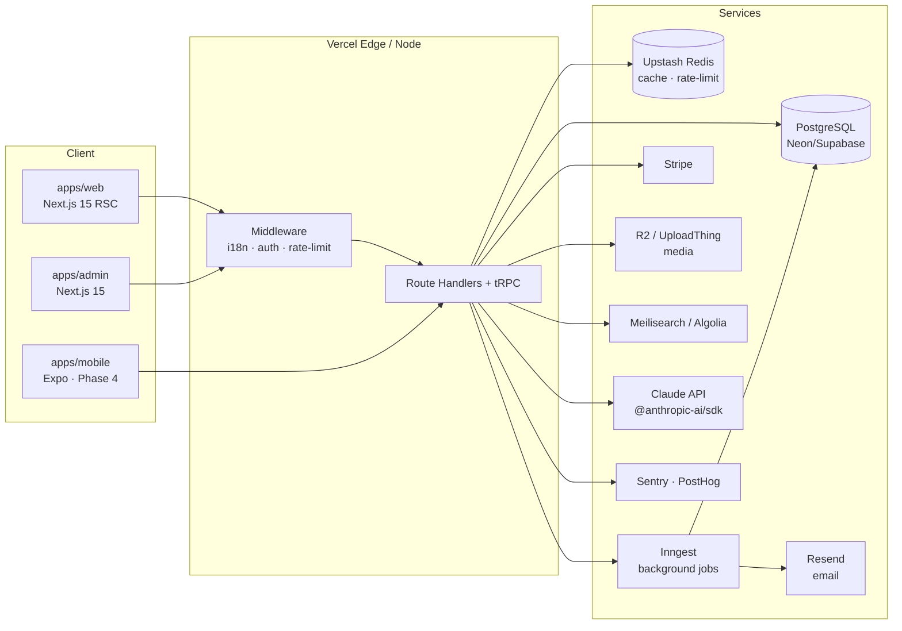

# Aerovy Travels

Premium, AI-assisted travel platform for **Abu Dhabi, UAE** — tours, desert safaris, city experiences, hotel packages, airport transfers, and custom itineraries.

> Status: **Phase 0 — foundation scaffold.** No application code yet.
> Next: Phase 1, Ticket 1 (see `docs/phases.md`).

---

## Table of contents

1. [Vision](#vision)
2. [Architecture](#architecture)
3. [Tech stack (and why)](#tech-stack-and-why)
4. [Monorepo layout](#monorepo-layout)
5. [Local setup](#local-setup)
6. [Environment variables](#environment-variables)
7. [Scripts reference](#scripts-reference)
8. [Deployment](#deployment)
9. [Phase roadmap](#phase-roadmap)
10. [Brand assets & design tokens](#brand-assets--design-tokens)
11. [Contributing](#contributing)
12. [License](#license)

---

## Vision

Aerovy Travels is a bookable travel platform for inbound tourists and UAE residents exploring Abu Dhabi. It sells tours, desert safaris, city experiences, hotel packages, airport transfers, and custom itineraries, with an AI trip-planner, multilingual support (EN / AR / HI / RU / ZH), and full admin operations.

Primary audiences:

1. **Travelers** — browse, get AI itineraries, book, pay, manage trips, review.
2. **Operations / Admin** — inventory, pricing, availability, bookings, customers, CMS, promos, reports.
3. **Suppliers** (Phase 3) — tour operators and hotels managing listings and payouts.

---

## Architecture



Full data model ERD, request flows, AI layer, and auth/role matrix: see [`docs/architecture.md`](./docs/architecture.md).

---

## Tech stack (and why)

| Layer         | Choice                                                        | Why                                                                          |
| ------------- | ------------------------------------------------------------- | ---------------------------------------------------------------------------- |
| Monorepo      | **pnpm + Turborepo**                                          | Fastest installs, strict hoisting, remote caching for CI free tier.          |
| Web/Admin     | **Next.js 15 (App Router) + React 19 + TypeScript**           | RSC, streaming, file-based routing, ISR, middleware — all in one.            |
| Styling       | **Tailwind CSS + shadcn/ui + Framer Motion**                  | Zero runtime CSS, ownable component primitives, no lock-in.                  |
| i18n          | **next-intl**                                                 | App Router-native, ICU messages, RTL-ready (AR).                             |
| API           | **tRPC + Zod**                                                | End-to-end types, no codegen, Zod doubles as runtime validator.              |
| Jobs          | **Inngest**                                                   | Durable steps, retries, cron — generous free tier, no infra to run.          |
| DB            | **PostgreSQL (Neon/Supabase) + Prisma**                       | Branch-per-PR DBs on Neon; Prisma for typed migrations.                      |
| Auth          | **Auth.js (NextAuth v5)**                                     | Magic links + Google OAuth, role column, shared session with Expo (Phase 4). |
| Payments      | **Stripe** (+ UAE gateway adapter stub)                       | Cards/Apple Pay/Google Pay day-one; Telr/NI pluggable later.                 |
| Media         | **Cloudflare R2** (or UploadThing)                            | Zero egress fees (R2); UploadThing if we want DX over cost.                  |
| Search        | **Meilisearch / Algolia**                                     | Final pick in Phase 1 Ticket 9 based on managed free-tier friction.          |
| AI            | **Claude API (`@anthropic-ai/sdk`)** wrapped in `packages/ai` | One module, prompt templates, token caps, cache, kill-switch env.            |
| Email         | **Resend + React Email**                                      | Typed templates; free tier covers early volume.                              |
| Analytics     | **PostHog Cloud + Vercel Web Analytics**                      | Free tiers; product + perf in one place.                                     |
| Observability | **Sentry**                                                    | Free tier for errors + tracing.                                              |
| Hosting       | **Vercel** (web/admin), **Neon** (DB), **Upstash** (Redis)    | All generous free tiers; zero-ops.                                           |
| Mobile (P4)   | **Expo + NativeWind**                                         | Shares TS types with monorepo; OTA updates.                                  |
| Testing       | **Vitest** (unit) + **Playwright** (single happy-path e2e)    | Fast; only business logic is unit-tested.                                    |

Anything paid or at risk of cost overruns is called out in the doc where it's introduced.

---

## Monorepo layout

```
/
├── apps/
│   ├── web/          # public marketing + booking + customer portal
│   ├── admin/        # internal admin panel
│   └── mobile/       # Expo app (Phase 4, scaffold only)
├── packages/
│   ├── ui/           # shared shadcn components + design tokens
│   ├── db/           # Prisma schema + client
│   ├── api/          # tRPC routers
│   ├── ai/           # Claude wrappers, prompt templates, guardrails
│   ├── config/       # eslint, tsconfig, tailwind presets
│   └── emails/       # React Email templates
├── assets/           # logo.png, logo-small.png, logo-source.pdf
├── docs/             # architecture.md, phases.md, ops.md
└── README.md
```

Phase 0 ships the root tooling only — `apps/` and `packages/` folders exist (`.gitkeep`), their contents land in Phase 1 tickets.

---

## Local setup

### Prerequisites

- **Node.js 20 LTS** (see `.nvmrc`)
- **pnpm 9+** (`corepack enable` is enough — no global install needed)
- **Git** (required before `pnpm install` so Husky hooks can register)
- A PostgreSQL instance (local Docker or Neon branch) — **only required from Phase 1 Ticket 4 onward**

### Install

```bash
git init                        # if not already a git repo
corepack enable
pnpm install
cp .env.example .env.local      # fill in as phases require
```

### Run

```bash
pnpm dev        # runs every app's dev server via Turbo (no apps yet in Phase 0)
pnpm lint
pnpm typecheck
pnpm test
pnpm build
```

---

## Environment variables

See [`.env.example`](./.env.example) for the complete list. Variables are grouped and only loaded when the relevant phase lands:

- **Core** — `NODE_ENV`, `NEXT_PUBLIC_APP_URL`
- **Database** (P1) — `DATABASE_URL`, `DIRECT_URL`
- **Auth** (P1) — `AUTH_SECRET`, `AUTH_GOOGLE_ID`, `AUTH_GOOGLE_SECRET`, `AUTH_RESEND_KEY`
- **Payments** (P1) — `STRIPE_SECRET_KEY`, `STRIPE_WEBHOOK_SECRET`, `NEXT_PUBLIC_STRIPE_PUBLISHABLE_KEY`
- **Media** (P1) — `R2_ACCOUNT_ID`, `R2_ACCESS_KEY_ID`, `R2_SECRET_ACCESS_KEY`, `R2_BUCKET`
- **Email** (P1) — `RESEND_API_KEY`, `EMAIL_FROM`
- **AI** (P2) — `ANTHROPIC_API_KEY`, `AI_DAILY_SPEND_CAP_USD`, `AI_KILL_SWITCH`
- **Cache / rate-limit** (P1) — `UPSTASH_REDIS_REST_URL`, `UPSTASH_REDIS_REST_TOKEN`
- **Jobs** (P1) — `INNGEST_EVENT_KEY`, `INNGEST_SIGNING_KEY`
- **Observability** — `SENTRY_DSN`, `NEXT_PUBLIC_POSTHOG_KEY`

No secrets are ever committed. `.env.local`, `.env.*.local`, and `.env.production` are git-ignored.

---

## Scripts reference

Root scripts (delegate to Turbo):

| Script           | What it does                                          |
| ---------------- | ----------------------------------------------------- |
| `pnpm dev`       | Runs all workspace dev servers in parallel.           |
| `pnpm build`     | Builds all workspaces with caching.                   |
| `pnpm lint`      | Lints all workspaces (ESLint flat config).            |
| `pnpm typecheck` | `tsc --noEmit` across all workspaces.                 |
| `pnpm test`      | Runs Vitest in each workspace that defines `test`.    |
| `pnpm format`    | Prettier write across the repo.                       |
| `pnpm clean`     | Removes `.turbo`, `node_modules`, and `dist` outputs. |

Husky runs `lint-staged` on commit (format + lint changed files only).

---

## Deployment

**Web & Admin → Vercel**

- One Vercel project per app (`apps/web`, `apps/admin`).
- Env vars mirrored from `.env.example`.
- Preview deploys per PR with Neon DB branches.

**Database → Neon (or Supabase)**

- Free tier; branch-per-PR via Neon GitHub integration.

**Cache / rate-limit → Upstash Redis**

- REST mode; free tier.

**Background jobs → Inngest**

- Deploy endpoint served from `apps/web/app/api/inngest/route.ts`.
- Functions defined in `packages/ai` and feature packages.

**Media → Cloudflare R2**

- S3-compatible; no egress fees.

**Email → Resend**

- React Email templates in `packages/emails`.

**Observability**

- Sentry (free tier) + PostHog Cloud + Vercel Web Analytics.

Detailed runbooks live in `docs/ops.md` (added in Phase 1 Ticket 14).

---

## Phase roadmap

Summarized here; full ticket breakdown in [`docs/phases.md`](./docs/phases.md).

- **Phase 1 — Foundation (MVP).** Monorepo apps, design system from the logo, marketing site, experiences browse/detail, cart + Stripe, auth + customer portal, admin v1, seed data, deploy.
- **Phase 2 — AI & Personalization.** Trip planner, smart search, concierge chatbot, SEO content gen (with review queue), review summaries, full guardrails.
- **Phase 3 — Operations depth.** Dynamic pricing, availability calendar, promo codes, gift cards, supplier portal, refunds workflow, multi-currency, WhatsApp notifications.
- **Phase 4 — Mobile.** Expo app, shared auth, QR tickets, push, offline itinerary.

---

## Brand assets & design tokens

Logo files (in `./assets/`):

- `logo.png` — 800 × 641 px, transparent BG. Web + admin.
- `logo-small.png` — 400 × 321 px. Favicons / mobile nav.
- `logo-source.pdf` — original vector; print only, **do not ship to web**.

### Palette (from the official logo — do not invent new colors)

| Token               | Hex       | Role                                                |
| ------------------- | --------- | --------------------------------------------------- |
| `--brand-primary`   | `#CDA020` | Aerovy gold — "A" mark + wordmark                   |
| `--brand-secondary` | `#2D151E` | Deep aubergine — paper-airplane, "TRAVELS" wordmark |
| `--brand-accent`    | `#E8C868` | Lighter gold highlight — hover/focus                |
| `--bg`              | `#FFFFFF` | Page background (light mode)                        |
| `--surface`         | `#FAF8F3` | Warm off-white card surface                         |
| `--text`            | `#2D151E` | Primary text                                        |
| `--muted`           | `#6B5A5F` | Secondary text, borders                             |

These ship in `packages/ui/tokens.css` and a Tailwind preset exposes them as `brand.primary`, `brand.secondary`, `brand.accent` + semantic tokens (delivered in Phase 1 Ticket 2).

### Typography

- **Primary:** Tajawal (Arabic + Latin), served via `next/font`.
- **Fallback (Latin):** Inter.

The logo's wordmark is a geometric sans; Inter is a safe match. If you want a closer pair, the alternative I'd propose is **Bricolage Grotesque** (display-leaning geometric sans with tighter optical sizes) — open to approval before I wire it in.

### Favicons / OG

A one-shot `scripts/generate-icons.ts` (Phase 1 Ticket 2) uses `sharp` to emit `favicon.ico`, `apple-touch-icon.png`, `icon-192.png`, `icon-512.png`, `og-image.png` (1200×630) from `logo.png`. Output is committed. Source PDF is never shipped to web.

---

## Contributing

- **Branches:** `main` is protected. Feature branches: `feat/<ticket-id>-<slug>`; fixes: `fix/<slug>`.
- **Commits:** Conventional Commits (`feat:`, `fix:`, `chore:`, `docs:`, `refactor:`, `test:`). Pre-commit hook runs `lint-staged`.
- **PRs:** Must pass CI (lint + typecheck + test + build). Reviewer checks: tests on business logic only, Zod on every route boundary, no new dependencies unannounced.
- **Code style:** TypeScript everywhere, no `any` without a `// TODO` and justification, Prettier enforced.
- **Secrets:** Never commit. Use `.env.local` locally and Vercel env vars in deploy.

---

## License

TBD — placeholder **UNLICENSED** until the company entity is registered and a license is chosen (likely proprietary with a selective-open-source policy for `packages/ui`). See [`LICENSE`](./LICENSE).
